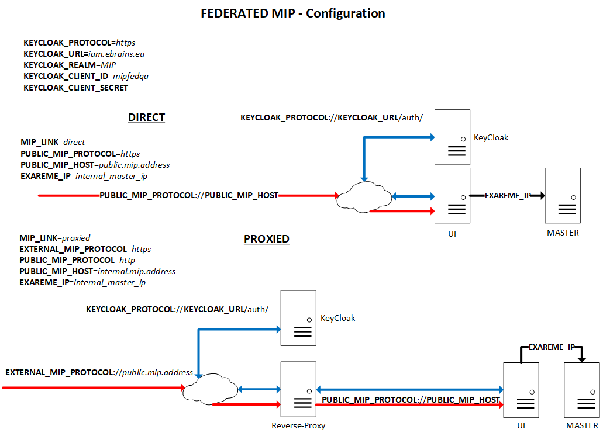

<a href="Readme.md#PreparingUI">Federated MIP Deployment</a> -> `Preparing the ui node`

# Preparing the **ui** node
1. Install the **ui**

   As a "sudoer" user:
   1. Set the hostname, with a meaningful name, i.e.
      ```
      sudo hostnamectl set-hostname <FEDERATION_NAME>-ui
      ```
   1. Configure the networking, including the DNS client
   1. Install the MIP
      ```
      git clone https://github.com/HBPMedical/mip-deployment
      ```
      ```
      sudo mip-deployment/mip --node-type ui --yes --no-run install
      ```
      Here, the *--node-type* parameter is very important, because it tells the script that this node will be a **ui**.  
      Following the same process than for the workers and the master, you can also put the specific parameters (*--version*, *--branch* or *--commit*, used with the flag *--force-install-unstable*) if you want to install a specific version.  
      As a reminder, the MIP will be installed by default in */opt/mip-deployment*.  
      Still by default, the *mip-deployment* folder you just created when cloning the repository will be deleted after the installation. If you want to keep it, just use the *--keep-installer* flag.

1. Configure the **ui**

   Still as the "sudoer" user:
   ```
   sudo mip --node-type ui configure all
   ```
   With this command, the *mip* script will interactively ask you for the different parameters. Of course, you can also set these parameters within the *mip configure* command.  
   If you want to configure a particular part, you can run *sudo mip configure \<PART>* (like *sudo mip --node-type ui configure exareme-ip*).  
   At last, if you want to **re**-configure something, you will have to use the *--force* flag.

   The configurations which come as variables will be written in the *.mipenv* file, at the root level of the *mip-deployment* folder. This file is automatically set by the *mip configure* command, but can also be edited by hand (**IF YOU KNOW WHAT YOU'RE DOING**) later on (running *mip configure* is still a mandatory step prior to doing anything like that).  

   For each of these variables, there is a matching *mip configure* command parameter:

   |Variable|Command parameter|Mandatory|
   | -- | -- | -- |
   |MIP_LINK|--link \<direct \| proxied>|yes|
   |EXTERNAL_MIP_PROTOCOL|--ext-protocol \<http \| https>|yes|
   |PUBLIC_MIP_PROTOCOL|--protocol \<http \| https>|yes|
   |PUBLIC_MIP_HOST|--host \<HOSTNAME/IP_ADDRESS>|yes|
   |EXAREME_IP|--exareme-ip \<EXAREME_IP>|yes|
   |KEYCLOAK_AUTHENTICATION (0/1)|--without-keycloak-authentication \| --with-keycloak-authentication|yes|
   |KEYCLOAK_PROTOCOL|--keycloak-protocol \<http \| https>||
   |KEYCLOAK_URL|--keycloak-url \<HOSTNAME/IP_ADDRESS>||
   |KEYCLOAK_REALM|--keycloak-realm \<KEACLOAK_REALM>||
   |KEYCLOAK_CLIENT_ID|--keycloak-client-id \<KEACLOAK_CLIENT_ID>||
   |KEYCLOAK_CLIENT_SECRET|--keycloak-client-secret \<KEACLOAK_CLIENT_SECRET>||
   |DATACATALOGUE_PROTOCOL|--datacatalogue-protocol \<DATACATALOGUE_PROTOCOL>||
   |DATACATALOGUE_HOST|--datacatalogue-host \<DATACATALOGUE_HOST>||

   Note that if you don't provide anything for KeyCloak, it will use the default configuration to connect to the central *EBRAINS*' KeyCloak, with the *mipfedqa* client.  
   For the data catalogue, the default *EBRAINS* DC hostname will be used as well, if no replacement value is provided.

   In order to better understand the different configuration parameters, check the following picture:
   

   You can see that there are two different setups:
   * **direct**

     The **ui** node's Web interface is directly reachable from the browser.

   * **proxied**

     The **ui** node's Web interface is reachable through a reverse-proxy server. Currently, it's been tested and validated with Apache server, with this specific VirtualHost configuration:

     ```
     ServerName public.mip.address

     <Location />
         ProxyPass http://internal.mip.address/
         ProxyPassReverse http://internal.mip.address/
         Allow from all
         Required all granted
     </Location>
     ```

     Again, don't hesitate to use:
     ```
     mip --help
     ```
