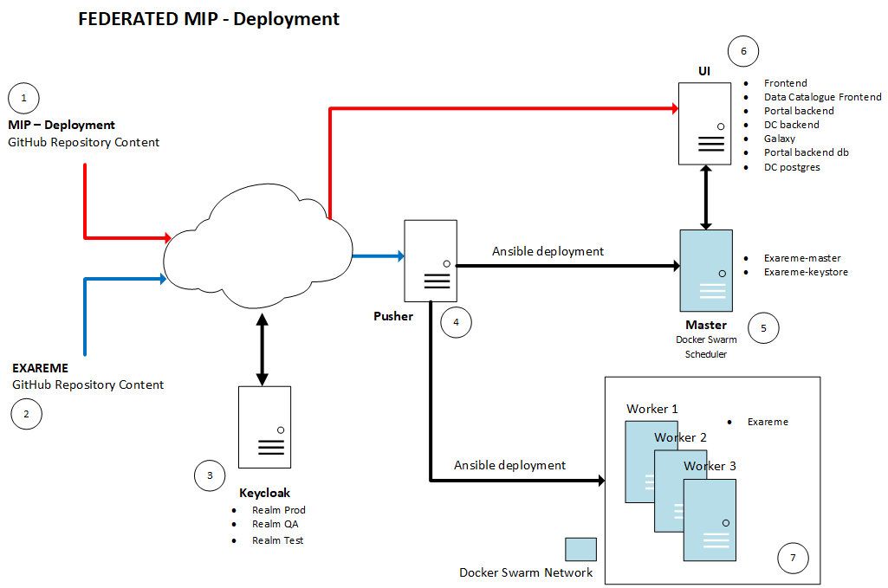

# Federated MIP Deployment
## Structure

The federated MIP is meant to run on different VM/Physical servers (nodes):

* A **Pusher** (*4*)
* A **Master** (*5*)
* A **UI** (*6*)
* Some **Workers** (*7*)

As the *pusher* service can run on any node, the bare minimum number of required servers is 3. As the opposite as a *local* MIP setup, all the required components are not in this *mip-deployment* repository (*1*).  
As an additional part, for all the backend requirements, we will need *exareme* repository (*2*) content, another component (provided as an external service) which is the global *HBP* keycloak's instance (*5*), and finally, a component which can be used in a more punctual way: the *data catalogue*.  
It means that the federated MIP is not meant (at least not at the moment) to run as an independant MIP setup, which you may already use with the local MIP.

### Pusher (*4*)
The **Pusher** will contain all the *exareme* repository (*2*) structure. Its role will be to "push" containers and configurations to the **Master** and the **Worker** nodes, and to initiate a Docker Swarm network from the **Master**.  
This pusher will need to have an *ssh* access to the master and the workers, and this will also include *root* access there.  
As a Docker Swarm network is quite complicated in terms of layer 3 network protocols and layer 4 TCP and UDP port requirements, it is highly recommended to run all the different nodes in the same network subnet. That's why, if you need to have remote **Worker** nodes in hospitals, it's better to build a VPN connectivity (preferably in layer 2) between all the nodes.  
As this **Pusher** is a central actor in the federation, it's also the best candidate to initiate federated actions, like the synchronization (consolidation) of metadata and pathologies details over the federation.

### Master (*5*)
The **Master** will "schedule" the **Workers**. This will be the main Docker Swarm network component, the Swarm Master.  
The Docker containers running on this machine will be *exareme-master* and *exareme-keystore*.

### UI (*6*)
The **UI** will contain most of the MIP Docker containers, but it won't have any *exareme* nor *keycloak* related container.  
This node will require a TCP connection with the **Master** node only (not mentioning external keycloak's instance, nor the reference to the external data catalogue).  
This *mip-deployment* repository (*1*) includes a "Federation" subfolder with another *docker-compose.yml* file, which contains references to the different Docker images (hosted on Docker Hub (*2*)) and their version tag, required to run the **UI** node only!  
As this node will actually run the user Web interface, it will be the only one which actually requires to be reachable with HTTP.

### Workers (*7*)
The **Worker** nodes (at least one) will have to host actual node (hospital) related datasets, and will run *exareme* container only.

## Requirements

## Setup
### Prepare the machines
Prepare a VM/Physical machine with **Ubuntu 20.04** server, for each node of the federation. As we want federated data, we'll typically go with two workers, with the following plan:

* **pusher**
* **ms** (master)
* **ui** (frontend)
* **wk1** (worker 1)
* **wk2** (worker 2)

### Prepare the worker nodes
1. Install the workers

On each worker node, as root:

        git clone https://github.com/HBPMedical/mip-deployment
        mip-deployment/mip --node-type wk --quiet --yes install

2. Configure the workers

On each worker node, as root:

        mip --node-type wk --quiet --yes configure all

By default, this will create a user *mipadmin* (which will be in *docker* and *sudo* groups), which will be the user with who the *pusher* will connect to operate this node. If you don't know its password, or you want to change it, do it right now with:

        passwd mipadmin

Later, you (or the central sysadmin) will need to provide the *pusher* informations about this node:

* Its IP address, with which the pusher will connect (with ssh), using mipadmin user:

        ip a
* Its hostname:

        hostname
* The user (*mipadmin*), and the corresponding *password*

3. Prepare the data

* On each worker, as **mipadmin** user, prepare the federation data folder. Go with this pattern:

        mkdir -p /data/<FEDERATION_NAME>

For *mipfed1* federation, it will be /data/mipfed1
* Place your datasets in /data/<FEDERATION_NAME>/<PATHOLOGY_NAME>/
* If you have CDE metadata files, it will have to be, or placed in the **master** node, or downloaded (latest version for now) from central data catalogue.

### Prepare the master node
1. Install the master

As root:

        git clone https://github.com/HBPMedical/mip-deployment
        mip-deployment/mip --node-type ms --quiet --yes install

2. Configure the master

As root:

        mip --node-type ms --quiet --yes configure all

Like for the workers, by default, this will create a user *mipadmin* (which will be in *docker* and *sudo* groups), which will be the user with who the *pusher* will connect to operate this node as well. If you don't know its password, or you want to change it, do it right now with:

        passwd mipadmin

Later, you will need to provide the *pusher* informations about this node as well:

* Its IP address, with which the pusher will connect (with ssh), using mipadmin user:

        ip a
* Its hostname:

        hostname
* The user (*mipadmin*), and the corresponding *password*

3. Prepare the CDE metadata files (**only if you don't want to automatically download their latest version on data catalogue**)

If you want to manage your CDEs by yourself, you'll have to place them on the **master** node, as follows.  
For every pathology over the whole federation, as **mipadmin** user:

        mkdir -p /data/<FEDERATION_NAME>/<PATHOLOGY_NAME>

Then, still as **mipadmin**, place the corresponding *CDEsMetadata.json* file in the right pathology folder.

### Prepare the UI node
1. Install the ui

As root:

        git clone https://github.com/HBPMedical/mip-deployment
        mip-deployment/mip --node-type ui --quiet --yes --no-run install

2. Configure the ui

For this part, you will need to know two things:

* The IP or <HOSTNAME> or even <HOSTNAME>:<PORT> on which you will expose the MIP Web user interface.  
It may be the public URL on a reverse-proxy machine, like https://your-mip.yourdomain.com, or just the IP and port on which you will expose your MIP outside your VM, i.e. if your MIP runs inside a vagrant VM. If your computer which hosts the VM has the IP 192.168.1.2 and you chose to map the port 80 of your VM on the port 8888 of your computer, you will have to provide:  
192.168.1.2:7777

* The IP of the exareme master Swarm server, so the **master** node of your system, i.e. 192.168.56.102

As **mipadmin** user:

        mip --node-type ui --quiet --yes --host https://your-mip.yourdomain.com --exareme-ip 192.168.56.102 --with-keycloak-authentication configure all

### Prepare the pusher node
As the **pusher** can virtually be any type of node (as it doesn't conflict with any MIP component), the pusher is not a type of node, but a flag in the *mip* script.  
Also, as the **pusher** will operate the federation, remotely controlling the **worker** and **master** nodes, the federation name will be required for each pusher operation. It also means that a pusher can manage many different federations from the same machine (which can also be a participant node in a federation, at the same time).

1. Install the pusher

As root:

        git clone https://github.com/HBPMedical/mip-deployment
        mip-deployment/mip --quiet --yes --pusher --federation mipfed1

2. Configure the pusher

As this operation is something that requires to be interactive at a moment, we won't use --quiet nor --yes parameters.

As root:

        mip --pusher --federation mipfed1 configure all

This will ask you to provide informations about the **worker** and **master** nodes, to prepare ssh identity exchange with the federation participants.  
This is very important, for the worker names choice, to match the current *hostname* of the corresponding node!

### Consolidate data
On the pusher, as **mipadmin** user:

        mip --pusher --federation mipfed1 data consolidate

### Prepare exareme deployment
On the pusher, as **mipadmin** user:

        /opt/<FEDERATION_NAME>/exareme/Federated-Deployment/Docker-Ansible/scripts/deploy.sh

* You'll have to provide mipadmin's password.  
* Then, you'll have the choice to store the Ansible vault's password in a clear text file (.vault_pass.txt). It's up to you to decide.  
If yes, this deploy.sh script won't ask you the *vault* password again.  
If no, the script will constantly (for now) ask you the *vault* password...
* Enter your chosen *Ansible Vault* password.
* In the script, choose **6**
* Enter *hbpmip/exareme* as the EXAREME image name
* For the EXAREME image tag, if you don't know which one to choose, check on the **ui** node:

        awk -F '=' '/^EXAREME/ {print $2}' /opt/mip-deployment/.versions_env
* Again in the script, choose **7**. You'll have to provide informations you got from the **worker** and **master** nodes.
  * At the question "What is the home path for target master?", you can enter /home/mipadmin
  * For the question "What is the data path for target master?", you can enter /data/<FEDERATION_NAME>
  * For the remote user, you should enter *mipadmin*, then its password, then *mipadmin* again for the "become" user
* The script will then ask you if there is any target workers. You'll have to enter *y*, then tell how many workers (2 in our case), then enter the same things that you entered for the master, but adapted to each worker node. For each node, you'll have to give its **real** hostname, which you got earlier on each worker.
* Once done with the configuration, within the same script, you can choose **1**. It should deploy exareme on the master and on the worker nodes. The script may ask you "Do you wish to run Portainer service?". If you don't know what is Portainer, just answer *n*.
* Finally, when back to the script's main menu, just choose **10**.

### Controlling the backend
On **master** node, as **mipadmin** user:

        mip status

You should see two lines with "1/1 replicas on ms", and as much "1/1 replicas on wk..." lines as you have worker nodes.

### Run the UI
On **ui** node, as **mipadmin** user:

        mip start

Once all started, you should be able to browse the MIP on the written URL. Enjoy!

Of couse, the *mip* script allows you to do much more things, depending on the type of node on which you launch it. Just do:

        mip --help
