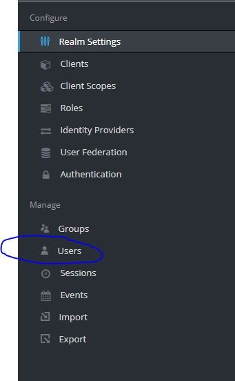
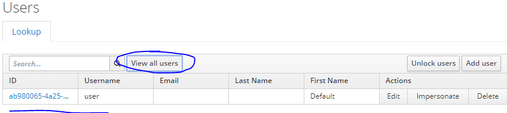

# MIP Deployment Guide

## Introduction

The deployment process is divided into different parts along with the different software stacks that need to be deployed. The services that will be deployed are:

1. Web-Analytics-Pack
2. Exareme
3. Galaxy
4. Galaxy-Middleware-API

This guide will assist you in deploying all the packs together and explain what dependencies each one has with the rest. This guide does not include detailed installation steps for each service but will prompt you to the appropriate guide.

## Requirements

Each software stack has it's own requirements but in order to deploy everything into one machine you need at least 16 GB of ram.

All of the software stack is based on docker so you need to install it in the machines that you will use:

- docker (tested using version 17.05.0-ce)
- docker-compose (tested using version 1.17.0)

Each software stack has more specific requirments

## Deployment

### 1. Install Exareme

You can install exareme locally by following this guide:
[Local Deployment Guide](https://github.com/madgik/exareme/tree/master/Local-Deployment)

Or you can install federated exareme by following this guide:
[Federated Deployment Guide](https://github.com/madgik/exareme/tree/master/Federated-Deployment)

In the next steps you will need to provide the IP of the master node of Exareme which will be refered as EXAREME_IP so keep that in mind.

### 2. Install Galaxy

In order to deploy Galaxy you need:

1. `EXAREME_IP` (from step 1)
2. `EXAREME_PORT` (default 9090)

With that information you can follow the [Galaxy Installation Guide](https://github.com/madgik/galaxy/tree/master/Docker_Build_Scripts) to deploy Galaxy.

After installing Galaxy an API key should be created:

- Enter Galaxy from the browser.
- Select the "User" Drop Down menu, on the navigation bar.
- Select the "Preferences" option.
- Select the "Manage API Key" option.
- "Create a new key"
- Copy the key so we can use it in the next step.

From this installation, remember the following details:

1. `GALAXY_URL` (the url where galaxy is visible e.g. http://88.197.53.100:8090/ )
2. `GALAXY_API_KEY` (the key that you created inside Galaxy)
3. `GALAXY_PASSWORD` (the password that you provided when deploying Galaxy)
4. The reverse proxy endpoint for galaxy, default to `nativeGalaxy`

### 3. Install Galaxy Middleware API

In order to deploy the Galaxy Middleware API you need:

1. `GALAXY_URL` (from step 2)
2. `GALAXY_API_KEY` (from step 2)
3. `GALAXY_PASSWORD` (from step 2)

You can now follow this [Galaxy Middleware API Deployment Guide](https://github.com/madgik/Galaxy_Middleware_API/)

From this installation, remember the following details:

1. `WORKFLOW_URL` (the endpoint of the api e.g. http://88.197.53.100:8091/Galaxy_Middleware_API-1.0.0-SNAPSHOT/api )
1. `JWT_SECRET` (provided in the installation process)

### 4. Install Web-Analytics-Pack

Clone this repository in your machine where it will be installed.

#### Initialize the variables

In order to deploy the Web Analytics Pack you need:

1. `EXAREME_URL` (`EXAREME_IP`:`EXAREME_PORT` from step 1 e.g. http://155.105.200.235:9090 )
2. `GALAXY_CONTEXT` (reverse proxy endpoint, default to `nativeGalaxy`) (from step 2)
3. `GALAXY_USERNAME` (`GALAXY_USERNAME`:`admin`) (from step 2)
4. `GALAXY_PASSWORD` (`GALAXY_PASSWORD`:`password`) (from step 2)
5. `JWT_SECRET` (from step 3)

Go to the `docker-compose.yml` file and modify these env variables with the values that you have from the previous steps. You can also modify the images of the portal-backend and the portal-frontend depending on what you want to deploy.

#### Setup the pathologies

Go to the `data` folder and there you will find a `pathologies.json` file.

This is used to inform the frontend what are the available datasets and CDEs. Modify this file accordingly before deploying.

#### 5. Modify the Keycloak authentication server

#### Create a User
Login to your running keycloak (e.g. https://88.197.53.106:8095/auth/admin/ 

 

Use credentials 

UserName : admin 

Password: Pa55w0rd 

 

Select users : 

Then add user: 

Fill in the relevant info. 

Then you can view your newly created user by clicking view Users.

#### Add roles to a User

To add roles click on your user and select the Role Mappings tab.

Select Add the ROLE_Researcher and the ROLE_Data Manager (optional) 

#### Switch between different keycloak servers 
In order to change between keycloak servers you will need to change some environment variables  

in docker-compose.yml 

Example setup: 

(if your keycloak is setup in IP: https://iam.humanbrainproject.eu with clientid : medical-informatics-platform, clientsecret: SaNJbC2YFHPhPM-tGiJ1b7tmAA): 
portalbackend: 
…. 

environment: 
CLIENT_ID: medical-informatics-platform 

CLIENT_SECRET:SaNJbC2YFHPhPM-tGiJ1b7tmAA 

AUTH_URI: "https://iam.humanbrainproject.eu/auth/realms/MIPTEST/protocol/openid-connect/auth" 

USER_INFO_URI: "https://iam.humanbrainproject.eu/auth/realms/MIPTEST/protocol/openid-connect/userinfo" 

TOKEN_URI: "https://iam.humanbrainproject.eu/auth/realms/MIPTEST/protocol/openid-connect/token" 

KEYCLOAK_URL: "https://iam.humanbrainproject.eu" 

Then to change and use a local keycloak server (located in e.g. 88.197.53.106) change variables to: 

CLIENT_ID: *new_client_id* 

CLIENT_SECRET:*new_client_secret* 

AUTH_URI: "https://88.197.53.106:8095/auth/realms/MIP/protocol/openid-connect/auth" 

USER_INFO_URI: "https://88.197.53.106:8095/auth/realms/MIP/protocol/openid-connect/userinfo" 

TOKEN_URI: "https://88.197.53.106:8095/auth/realms/MIP/protocol/openid-connect/token" 

LOGOUT_URI: https://88.197.53.106:8095/auth/realms/MIP/protocol/openid-connect/logout 

KEYCLOAK_URL: "88.197.53.106" 

#### Deploy

Run the `./run.sh` command to install the rest of the components.

After the installation is done, MIP will be visible on localhost.
