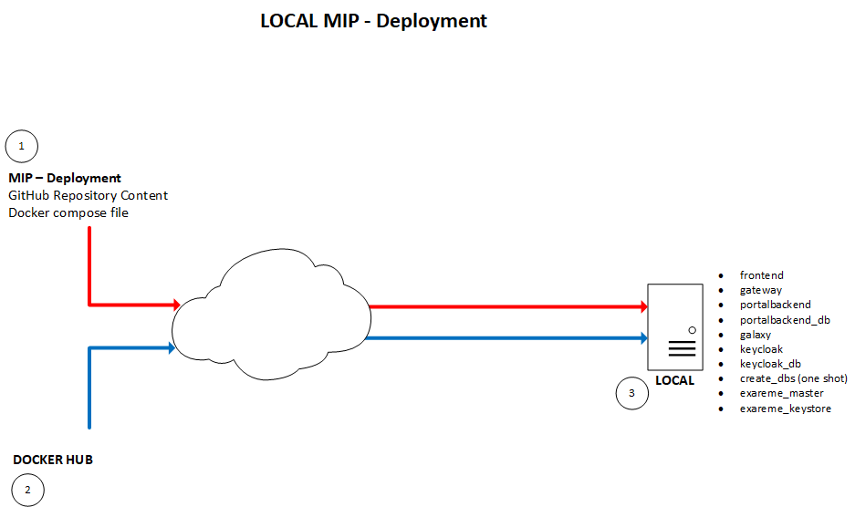

# Local MIP Deployment
## Structure

In this repository, we have both local and federated (in *Federation* subfolder) MIP structures.  

The local MIP is composed by a few Docker containers (*3*).  
This *mip-deployment* repository (*1*) includes a *docker-compose.yml* file, which contains references to the different Docker images (hosted on Docker Hub (*2*)) and their version tag.  
The *mip* script will be able to manage the installation process, as well as the different administration aspects.  

Once running, by default, the client browser will arrive on a landing page which will redirect it on the local keycloak (provider as a container) instance's page for authentication (with credentials *user*:*password*). Once connected, the client browser will be redirected to the HOSTNAME:PORT set during the configuration step.  
Therefore, it's important that both the keycloak container and the client browser can reach the HOSTNAME:PORT provided as the *PUBLIC_MIP_HOST* variable.  
It means that if the MIP installation runs inside a VM which is connected via a NATted network, this HOSTNAME:PORT should be the one of the *host* (the machine which runs the hypervisor), and not the one of the *guest* (the VM).

## Requirements
Beside the basic OS requirements, everything you need to deploy a local MIP is available in this repository.
If you don't match the OS requirements, we recommend that you deploy it inside a Virtual Machine. For that purpose, you can use any hypervisor, but if you don't know much about it, Vagrant and VirtualBox should make things easier.

## Setup
1. Prepare a VM/Physical machine with **Ubuntu 20.04** server
2. As root:

        adduser mipadmin
        adduser mipadmin sudo
        mkdir /opt/mip
        chown mipadmin.mipadmin /opt/mip

3. As mipadmin:

        cd /opt/mip
        git clone https://github.com/HBPMedical/mip-deployment
        cd
        sudo ln -s /opt/mip/mip-deployment/mip /usr/local/bin/
        mip install

## Run
You can then launch the MIP with:

        mip start

The first time, it will launch the configuration procedure. Then, it won't ask you anything anymore, but you can still use the following command to reconfigure things:

        mip configure

At anytime, you can learn how to use the *mip* commands with:

        mip --help
