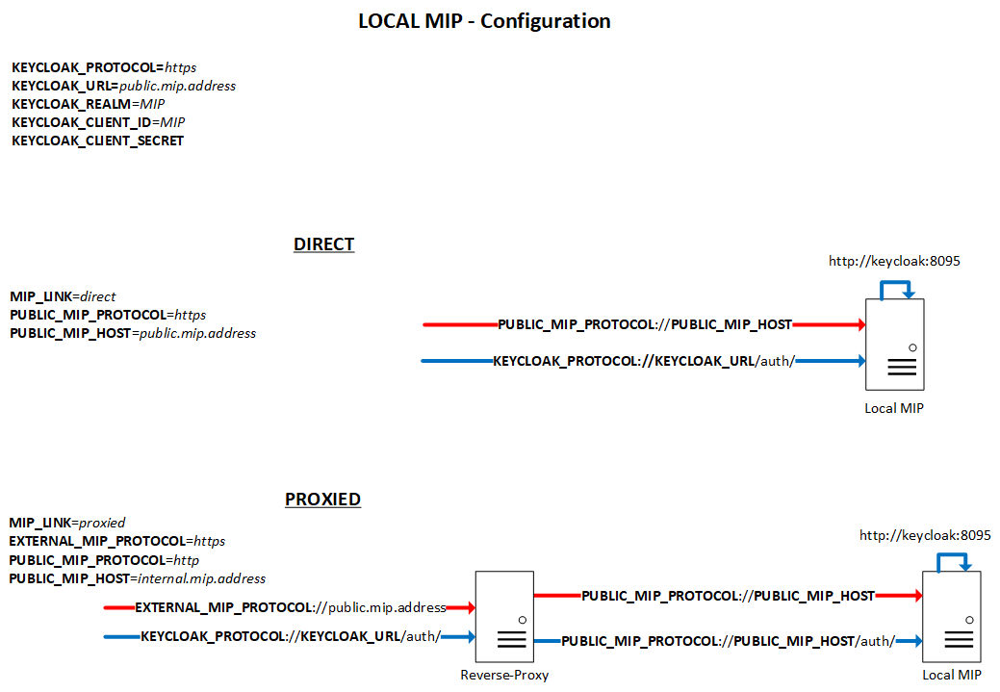

<a href="../README.md#LocalDeployment">MIP Deployment</a> -> `Local MIP Deployment`

# Local MIP Deployment
## Structure


In this repository, we have both local and federated (in *Federation* subfolder) MIP structures.  

The *local* MIP is composed by a few Docker containers (*3*), all running on the same machine.  
This *mip-deployment* repository (*1*) includes a *docker-compose.yml* file, which contains references to the different Docker images (hosted on Docker Hub (*2*)) and their version tag.  
The *mip* script will be able to manage the installation process, as well as the different administration aspects.  

Once running, by default, the client browser will arrive on a landing page which will redirect it on the local keycloak (provided as a container) instance's page for authentication (with credentials *user:password*). Once connected, the client browser will be redirected to the HOSTNAME:PORT which would has been set during the configuration process.  
Therefore, it's important that both the keycloak container and the client browser can reach the HOSTNAME:PORT provided as the *PUBLIC_MIP_HOST* variable.  
It means that if the MIP installation runs inside a VM which is connected via a NATted network, this HOSTNAME:PORT should be the one of the *host* (the machine which runs the hypervisor), and not the one of the *guest* (the VM).

## Requirements
### Hardware
* 40 GB HDD
* 8 GB RAM
* 2 CPU Cores

### Software
* Ubuntu Server 20.04 (minimal installation, without GUI).  
  Beside the basic OS requirements, everything you need to deploy a local MIP is available in this repository. If you don't match the OS requirements, we recommend that you deploy it inside a Virtual Machine. For that purpose, you can use any hypervisor, but if you don't know much about it, Vagrant and VirtualBox could make things easier.

## Setup
1. Prepare a VM/Physical machine with the minimal **Ubuntu Server 20.04** operating system installation.

   You'll have to know on which URL (like http://<HOSTNAME>, http://<HOSTNAME>:<PORT> or http://<IP>:<PORT>) you want to expose your MIP. If you're operating it inside a VM on your computer, you may use the IP of your computer, and the port on which your VM's port 80 is mapped to, like:
http://192.168.0.100:8888

1. Install the MIP

   As a "sudoer" user:
   ```
   git clone https://github.com/HBPMedical/mip-deployment
   ```
   ```       
   sudo mip-deployment/mip --no-run install
   ```
   Alternatively, you can also install a specific version of the MIP. For that purpose, you can precise the tag (*--version \<TAG>*), the branch (*--branch \<BRANCH>*) or even the commit ID (*--commit \<COMMIT>*), each of these parameters having precedence over the next one(s). If you specify a non-default version, you also have to force this installation with the flag *--force-install-unstable*.  
   The MIP will be installed by default in */opt/mip-deployment*.  
   Still by default, the *mip-deployment* folder you just created when cloning the repository will be deleted after the installation. If you want to keep it, just use the *--keep-installer* flag.  

   Don't hesitate to use:
   ```
   mip --help
   ```

1. Configure the MIP

   Still as the "sudoer" user:
   ```
   sudo mip configure all
   ```
   With this command, the *mip* script will interactively ask you for the different parameters. Of course, you can also set these parameters within the *mip configure* command.  
   If you want to configure a particular part, you can run *sudo mip configure \<PART>* (like *sudo mip configure keycloak*).  
   At last, if you want to **re**-configure something, you will have to use the *--force* flag.

   The configurations which come as variables will be written in the *.mipenv* file, at the root level of the *mip-deployment* folder. This file is automatically set by the *mip configure* command, but can also be edited by hand (**IF YOU KNOW WHAT YOU'RE DOING**) later on (running *mip configure* is still a mandatory step prior to doing anything like that).  

   For each of these variables, there is a matching *mip configure* command parameter:

   |Variable|Command parameter|Mandatory|
   | -- | -- | -- |
   |MIP_LINK|--link \<direct \| proxied>|yes|
   |EXTERNAL_MIP_PROTOCOL|--ext-protocol \<http \| https>|yes|
   |PUBLIC_MIP_PROTOCOL|--protocol \<http \| https>|yes|
   |PUBLIC_MIP_HOST|--host \<HOSTNAME/IP_ADDRESS>|yes|
   |KEYCLOAK_AUTHENTICATION (0/1)|--without-keycloak-authentication \| --with-keycloak-authentication|yes|
   |KEYCLOAK_PROTOCOL|--keycloak-protocol \<http \| https>||
   |KEYCLOAK_URL|--keycloak-url \<HOSTNAME/IP_ADDRESS>||
   |KEYCLOAK_REALM|--keycloak-realm \<KEACLOAK_REALM>||
   |KEYCLOAK_CLIENT_ID|--keycloak-client-id \<KEACLOAK_CLIENT_ID>||
   |KEYCLOAK_CLIENT_SECRET|--keycloak-client-secret \<KEACLOAK_CLIENT_SECRET>||
   |DATACATALOGUE_PROTOCOL|--datacatalogue-protocol \<DATACATALOGUE_PROTOCOL>||
   |DATACATALOGUE_HOST|--datacatalogue-host \<DATACATALOGUE_HOST>||

   Note that if you don't provide anything for KeyCloak, it will use the default configuration to connect to the "embedded" local KeyCloak, with the *MIP* client.

   In order to better understand the different configuration parameters, check the following picture:
   

   You can see that there are two different setups:

   * **direct**

     The MIP is directly reachable from the browser.

   * **proxied**

     The MIP is reachable through a reverse-proxy server. Currently, it's been tested and validated with Apache server, with this specific VirtualHost configuration:

     ```
     ServerName public.mip.address

     <Location />
         ProxyPass http://internal.mip.address/
         ProxyPassReverse http://internal.mip.address/
         Allow from all
         Required all granted
     </Location>
     ```

     Again, don't hesitate to use:
     ```
     mip --help
     ```

1. Become **mipadmin**

   After the first time that you run *mip configure*, the **mipadmin** user will be created. Then, anytime you need to operate the **ui** node, you should use this user.  
   If you don't know the *mipadmin* password, you can use the "sudoer" user to become *mipadmin*
   ```
   sudo su - mipadmin
   ```

1. Consolidate data

   As **mipadmin**, you can run
   ```
   mip data consolidate
   ```
   For each pathology, this will list the different available datasets in the pathology's Common Data Elements (CDE) file, and then, from all the CDEs, it will generate the *pathologies.json* file, used by the MIP Web interface to display the different variables.  
   Alternatively, you can ask to **re**-label the pathologies and/or the datasets by using the flag *--review-dataset-labels*.

1. Compile data

   As **mipadmin**, run
   ```
   mip data compile
   ```
   At any time, you can **re**-compile by using the *--force* flag.  
   You can also specify the pathology(ies) to compile, with the *--pathology* flag.  
   As usual, to get more details, use:
   ```
   mip --help
   ```

## Run
Still as **mipadmin** user, you can then launch the MIP with:
```
mip start
```

After launching, you should be able to browse the MIP on the URL which will be displayed. Note that once the command ends, it may still take up to one minute until the MIP is really operational.  
Of course, you can also do other actions here:
* Stopping the MIP
  ```
  mip stop
  ```
* Restarting the MIP
  ```
  mip restart
  ```
  Note that a *restart* is actually different from a "*stop* *start*" cycle. See the Docker documentation.

At anytime, you can learn more about the *mip* commands with:
```
mip --help
```
