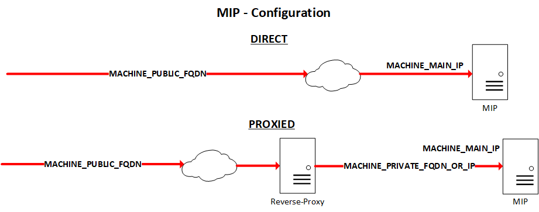

[UI](../README.md#UI) -> `MIP UI deployment`

In addition of the two other helm charts (exareme and exareme2), this one will run the components required to provide the MIP Web UI.

# Configuration
Prior to deploy it (on a microk8s K8s cluster of one or more nodes), there's some adjustments to do in the *values.yaml* file.  
There are sections which correspond to the different components. In each section, you can adjust the container image name and version, local storage paths if needed, and some other settings as well.  
Also, in addition to the main *values.yaml* file, there are some "profile" configuration files. These are made mostly to simplify the MIP reachability.  
We recommend that you fill all those profile configuration files. Then, whenever you want, you can easily switch between the different profiles, just by reinstalling the Helm chart with another profile.

There are still two main ways of reaching the MIP UI:
* Direct
* Proxied

For each of them, you have four different profiles:
* "Standard", with external KeyCloak authentication
  * **.direct**
  * **.proxied**
* With internal, embedded KeyCloak authentication
  * **.direct.internal_auth**
  * **.proxied.internal_auth**
* With unsecure embedded KeyCloak authentication
  * **.direct.internal_auth.http**
  * **.proxied.internal_auth.http**
* Without authentication
  * **.direct.no_auth**
  * **.proxied.no_auth**

In each of these profile configuration files, there are different settings already filled (which you may want to change) to cover most of the use cases, and others (between **<>**), which are required to be filled.

The following picture describes the different ways of reaching the MIP, and these specific required fields are present on it.


## MACHINE_MAIN_IP
This is the machine's main IP address. Generally, it's the IP address of the first NIC after the local one.  
If the MIP is running on top of a VPN, you may want to put the VPN interface's IP address.  
If you reach the machine through a public IP, if this IP is **NOT** directly assigned on the machine, but is using static NAT, you still **MUST** set the **INTERNAL** IP of the machine itself!

## MACHINE_PUBLIC_FQDN
This is the public, fully qualified domain name of the MIP, the main URL on which you want to reach the MIP from the Internet. This may point:
* Directly on the public IP of the MIP, for a **direct** use case. It may be assigned on the machine or used in front as a static NAT
* On the public IP of the reverse-proxy server, for a **proxied** use case

## MACHINE_PRIVATE_FQDN_OR_IP
This is **ONLY** used in a **proxied** use case situation.  
It's actually the internal IP or address from which the reverse-proxy server "sees" (reaches) the MIP machine.

Normally, these tree settings (repeated in several profile files) are the main things you have to know to set all these profiles.  

**WARNING!**: In **ANY** case, when you use an **EXTERNAL** KeyCloak service (i.e. iam.ebrains.eu), make sure that you use the correct *CLIENT_ID* and *CLIENT_SECRET* to match the MIP instance you're deploying!

# Deployment
**ONLY** after you have prepared all the profiles you may want to use, you can easily deploy the UI Helm chart.  
Also, we recommend that you deploy the engines (*exareme* and *mipengine*) Helm charts, prior to run the UI.

## Global installation
On a running Ubuntu (we recommend 22.04) distribution, install microk8s (we **HIGHLY** recommend to **NOT** install Docker on your Kubernetes cluster!):
```
sudo snap install microk8s
```
```
sudo adduser mipadmin
```
```
sudo adduser mipadmin sudo
```
```
sudo adduser mipadmin microk8s
```

As *mipadmin* user:
```
microk8s enable dns helm3 ingress
```
```
sudo mkdir -p /data/<MIP_INSTANCE_OR_FEDERATION_NAME>
```
```
sudo chown -R mipadmin.mipadmin /data
```

For a "federated" deployment, you may want to add nodes to your cluster. "microk8s add-node" will give you a **one-time usage** token, which you can use on a worker node to actually "join" the cluster. This process must be repeated on all the worker nodes.  

## Exareme
* Install the repository content
  ```
  sudo git clone https://github.com/madgik/exareme /opt/exareme
  ```
  ```
  sudo chown -R mipadmin.mipadmin /opt/exareme
  ```
* Set the variables in /opt/exareme/Federated-Deployment/kubernetes/values.yaml
  * data_path: /data/<MIP_INSTANCE_OR_FEDERATION_NAME>
  * exareme.convert_csvs: FALSE
  * workers: 0 for a "local" deployment, or more for a "federated" deployment
* Label the nodes  
  For all the worker nodes (even on a "local" deployment where the master and the worker are the **same** machine), add a *worker* label:
  ```
  microk8s kubectl label node <WORKER_HOSTNAME> worker=true
  ```
* Deploy the Helm chart
  ```
  microk8s helm3 install exareme /opt/exareme/Federated-Deployment/kubernetes
  ```

## MIP-Engine (Exareme 2)
* Install the repository content
  ```
  sudo git clone https://github.com/madgik/MIP-Engine /opt/mipengine
  ```
  ```
  sudo chown -R mipadmin.mipadmin /opt/mipengine
  ```
* Set the variables in /opt/mipengine/kubernetes/values.yaml
  * localnodes: 1 for a "local" deployment (yes, even if it's the same machine for master and worker), or more (the number of workers, not counting the master node) for a "federated" deployment
  * db.storage_location: /opt/mipengine/.stored_data/db
  * db.csvs_location: /data/<MIP_INSTANCE_OR_FEDERATION_NAME>
  * controller.cleanup_file_folder: /opt/mipengine/.stored_data/cleanup
  * smpc.enabled: true (if you want, and **ONLY** in case of a federated deployment, and also **ONLY** if you have at least 3 worker nodes!)
* Label the nodes  
  For all the worker nodes (even on a "local" deployment where the master and the worker are the **same** machine), add *worker* and (if you want) *smpc_player* labels:
  ```
  microk8s kubectl label node <WORKER_HOSTNAME> worker=true
  ```
  ```
  microk8s kubectl label node <WORKER_HOSTNAME> smpc_player=true
  ```
* Deploy the Helm chart
  ```
  microk8s helm3 install mipengine /opt/mipengine/kubernetes
  ```

## MIP UI
* Install the repository content
  ```
  sudo git clone https://github.com/HBPMedical/mip-deployment /opt/mip-deployment
  ```
  ```
  sudo chown -R mipadmin.mipadmin /opt/mip-deployment
  ```
* Set the different profiles in /opt/mip-deployment/kubernetes as explained before
* Deploy the Helm chart with a specific profile
  ```
  microk8s helm3 install mip -f /opt/mip-deployment/kubernetes/<PROFILE_CONFIGURATION_FILE> /opt/mip-deployment/kubernetes
  ```
