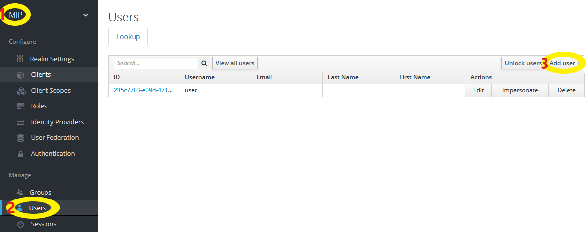

### Create a User

Login to the keycloak console on http://{MIP_IP}/auth/admin/ with the administrator credentials.

1) Select `MIP` -> `Users` -> `Add User` :

2) Provide the user information and then `Save`.

3) After adding a user go to the `Credentials` tab and fill in the password information.

You can then view your newly created user from the `Users` tab.

### Changing the password of a User

1) Select the `Users` tab.

2) Select a specific user.

3) Go to the `Credentials` tab.

4) Fill in the new password information.

