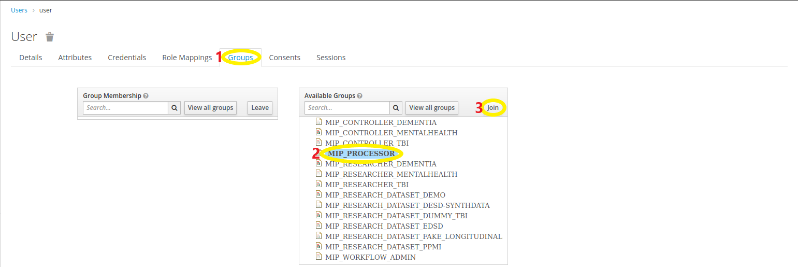
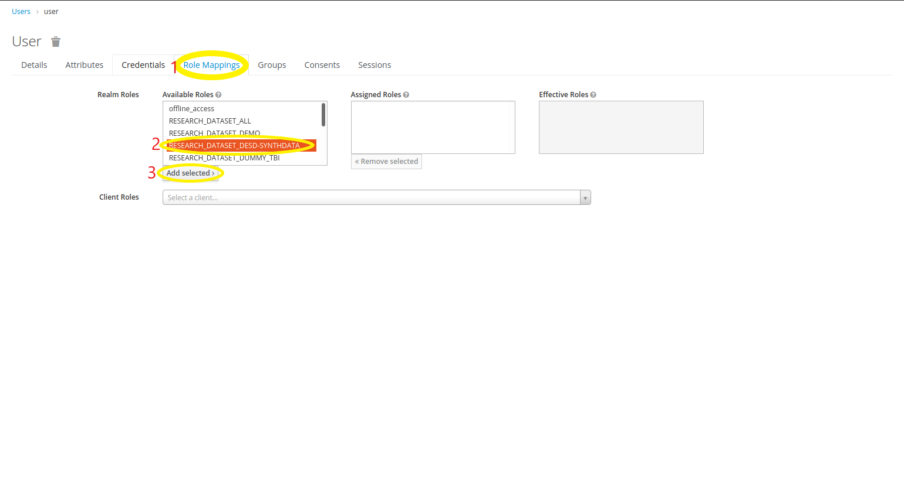

## User Authorizations

A user can be authorized on two different aspects:
  - He can be authorized to access specific pages,
  - or to access specific resources (datasets, pathologies e.t.c.) .

### Authorize User to access MIP

1) Select a user: `MIP` -> `Users` -> Select the user

2) Join the appropriate group for that user.

The following GROUPS should exist:
  - One group for each pathology, with the "MIP_CONTROLLER_" prefix. With the user joining this group, he is assigned to the according role with the "RESEARCH_PATHOLOGY_" prefix. This user can edit/remove/add CDEs in the specific federation of the pathology.
  - One role for each pathology, with the "MIP_RESEARCHER_" prefix. With the user joining this group, he is assigned to the according role with the "RESEARCH_PATHOLOGY_" prefix. This user can only conduct a federated analysis on the available data for this specific pathology.
  - One "Super User" group (MIP_PROCESSOR). With the user joining this group, he is assigned to the (RESEARCH_DATASET_ALL) , (RESEARCH_PATHOLOGY_ALL) (RESEARCH_EXPERIMENT_ALL). Any "Administrator" users can join this group in order for them to have access to everything.
  - One group (MIP_WORKFLOW_ADMIN). With the user joining this group, he is assigned to the (WORKFLOW_ADMIN) role.

### Authorize User to access Datasets

1) Select a user: `MIP` -> `Users` -> Select the user

2) Add the appropriate dataset permissions (ROLES).

The following ROLES should exist:
  - One role for each dataset, with the "RESEARCH_DATASET_" prefix. Assigning that role to the user he gets access to that specific dataset.
  - One role for each pathology, with the "RESEARCH_PATHOLOGY_" prefix. That role provides access to the pathology and all the datasets it contains.
  - One role (RESEARCH_DATASET_ALL) with which the user gets access to all datasets.
  - One role (RESEARCH_PATHOLOGY_ALL) with which the user gets access to all pathologies.
  - One role (RESEARCH_EXPERIMENT_ALL) with which the user gets access to all experiments.

### Adding a new dataset

When a new dataset is added on MIP, the following configurations should be made:
  - Go to `Roles` -> `Realm Roles` -> `Add Role`
  - On the Role Name you should enter the prefix `RESEARCH_DATASET_` and then the code of the new dataset. Then Save that `Role`.

If the dataset belongs to a new pathology, you could also add a role that will contain all the pathology datasets.
  - Follow the same process as with the dataset but with a "RESEARCH_PATHOLOGY_" prefix and create a role for the pathology.
  - Select that role.
  - On the `Details` tab select the `Composite Roles` option.
  - Afterwards, select all the dataset roles that belong to this pathology.
  - When a new dataset is added on the pathology, you should add it to this role, too.

With these configurations you can not assign a role to a user direclty. In order to do that the user needs to join the proper group which will automatically give the proper access rights.
If a user is assigned a pathology role, he will automatically gain access to all the pathology's datasets.
Example: In case a user is assigned the role (RESEARCH_PATHOLOGY_MENTALHEALTH), the user will automatically gain access to (RESEARCH_DATASET_DEMO) role.

