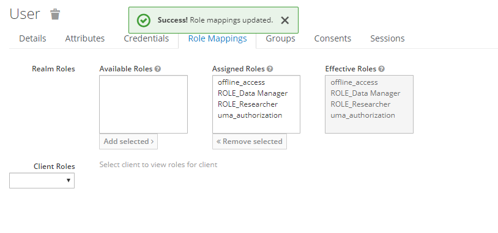

### Add roles to a User

Login to the keycloak console on http://{MIP_IP}/auth/admin/ with the administrator credentials.

Select users : 

Click view Users and select the user you want to add roles to.

Select the Role Mappings tab.

Select Add the ROLE_Researcher and the ROLE_Data Manager (Optional) 

