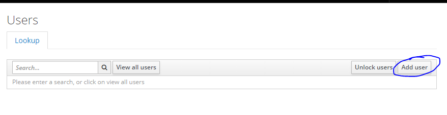

### Create a User

Login to the keycloak console on http://{MIP_IP}/auth/admin/ with the administrator credentials.

1) Select users : 

2) Add user: 

3) After adding a user go to the `Credentials` tab and fill in the password information.

Then you can view your newly created user by clicking view Users.

### Changing the password of a User

1) Select users : 

2) Select a specific user.

3) Go to the `Credentials` tab.

4) Delete the current password.

5) Fill in the new password information.

