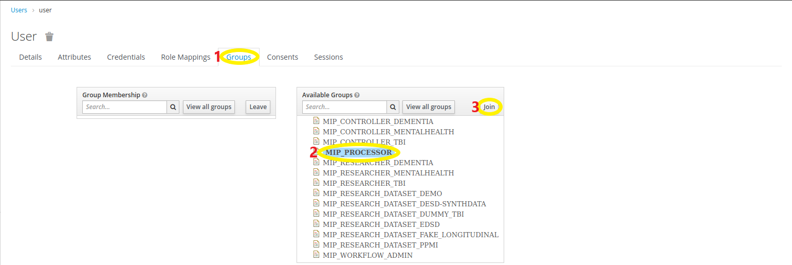
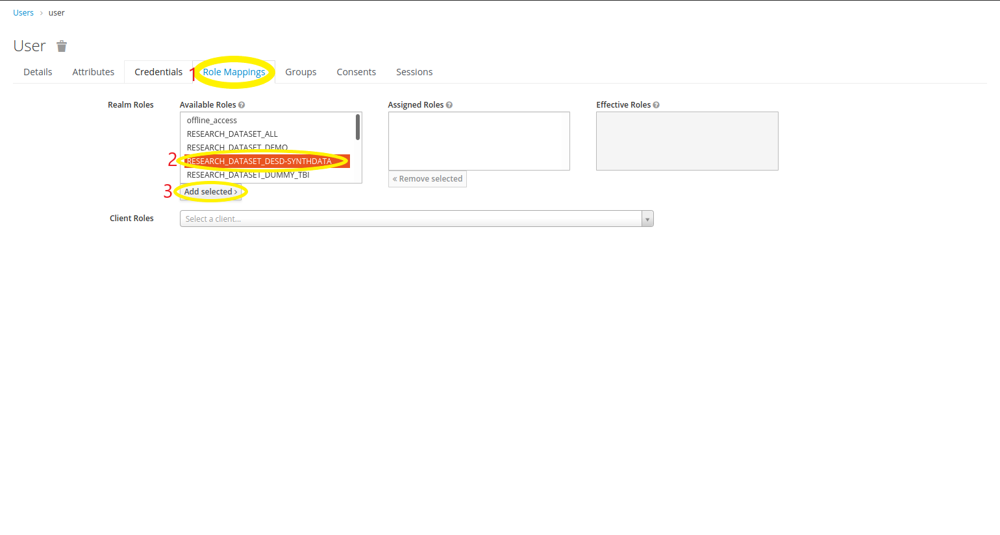

## User Authorizations

A user can be authorized on two different aspects:
  - He can be authorized to access specific pages,
  - or to access specific resources (datasets, pathologies e.t.c.) .

### Authorize User to access MIP

1) Select a user: `MIP` -> `Users` -> Select the user

2) Join the appropriate group for that user.

There are 2 available groups right now:
  - All users in order to have access to MIP should belong to the `Researchers` group. 
  - If you also want the user to have access to Galaxy, he should also belong to the `Data Managers` subgroup.

### Authorize User to access Datasets

1) Select a user: `MIP` -> `Users` -> Select the user

2) Add the appropriate dataset permissions (ROLES).

The following ROLES should exist:
  - One role for each dataset, with the "DATASET_" prefix. Assigning that role to the user he gets access to the pathology and that specific dataset.
  - One role for each pathology, with the "PATHOLOGY_" prefix. That role provides access to the pathology and all the datasets it contains.
  - One "Super User" role (DATASET_ALL) with which the user gets access to all pathologies and datasets. You can assign this role to any "Administrator" users that you always want them to have access to everything.

### Adding a new dataset

When a new dataset is added on MIP, the following configurations should be made:
  - Go to `Roles` -> `Realm Roles` -> `Add Role`
  - On the Role Name you should enter the prefix `DATASET_` and then the code of the new dataset. Then Save that `Role`.

If the dataset belongs to a new pathology, you could also add a role that will contain all the pathology datasets.
  - Follow the same process as with the dataset but with a "PATHOLOGY_" prefix and create a role for the pathology.
  - Select that role.
  - On the `Details` tab select the `Composite Roles` option.
  - Afterwards, select all the dataset roles that belong to this pathology.
  - When a new dataset is added on the pathology, you should add it to this role, too.

With these configurations you can now assign a pathology role to a user and he will automatically gain access to all the pathology's datasets.
