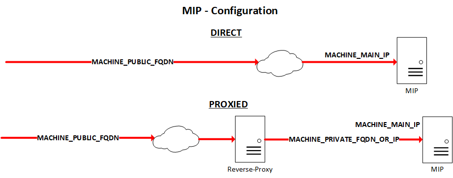

[UI](../README.md#) -> `MIP UI deployment`

In addition of the two other helm charts (exareme and exareme2), this one will run the components required to provide the MIP Web UI.

# Configuration
Prior to deploy it (on a microk8s K8s cluster of one or more nodes), there's some adjustments to do in the *values.yaml* file.
There are sections which correspond to the different components. In each section, you can adjust the container image name and version, local storage paths if needed, and some other settings as well.
Also, in addition to the main *values.yaml* file, there are some "profile" configuration files. These are made mostly to simplify the MIP reachability.

